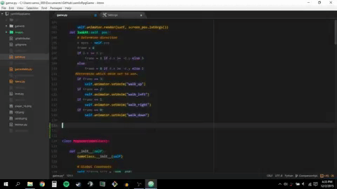

## 👋 Bonjour ! Bienvenue sur mon profil GitHub

## 🚀 À propos de moi

- 🌱 Je m'appelle Pricillia. Après avoir évolué pendant 10 ans dans le domaine de l’audit, je me suis reconvertie en tant que conceptrice développeuse d’applications, une passion que je nourris depuis longtemps. Mon expérience en audit m’a permis de développer une grande rigueur, une forte capacité d'analyse et une attention particulière aux détails, des qualités que j’applique maintenant au développement web. Curieuse de nature, autonome et dotée d'une grande capacité d’adaptation, je prends plaisir à relever de nouveaux défis et à explorer des solutions innovantes dans ce secteur en constante évolution.

- 🔭 Actuellement en formation chez Descodeuses, je travaille sur divers projets que vous pourrez découvrir à travers mes repositories.

- 🤝 Je suis à la recherche d'un **stage de 6 mois** à partir de **janvier 2025**.

- 📫 N'hésitez pas à me contacter : [pricillia.edou@gmail.com](mailto:pricillia.edou@gmail.com)

## 📊 Mes Stats GitHub

## 🛠 Technologies et outils

## 💬 Contactez-moi

